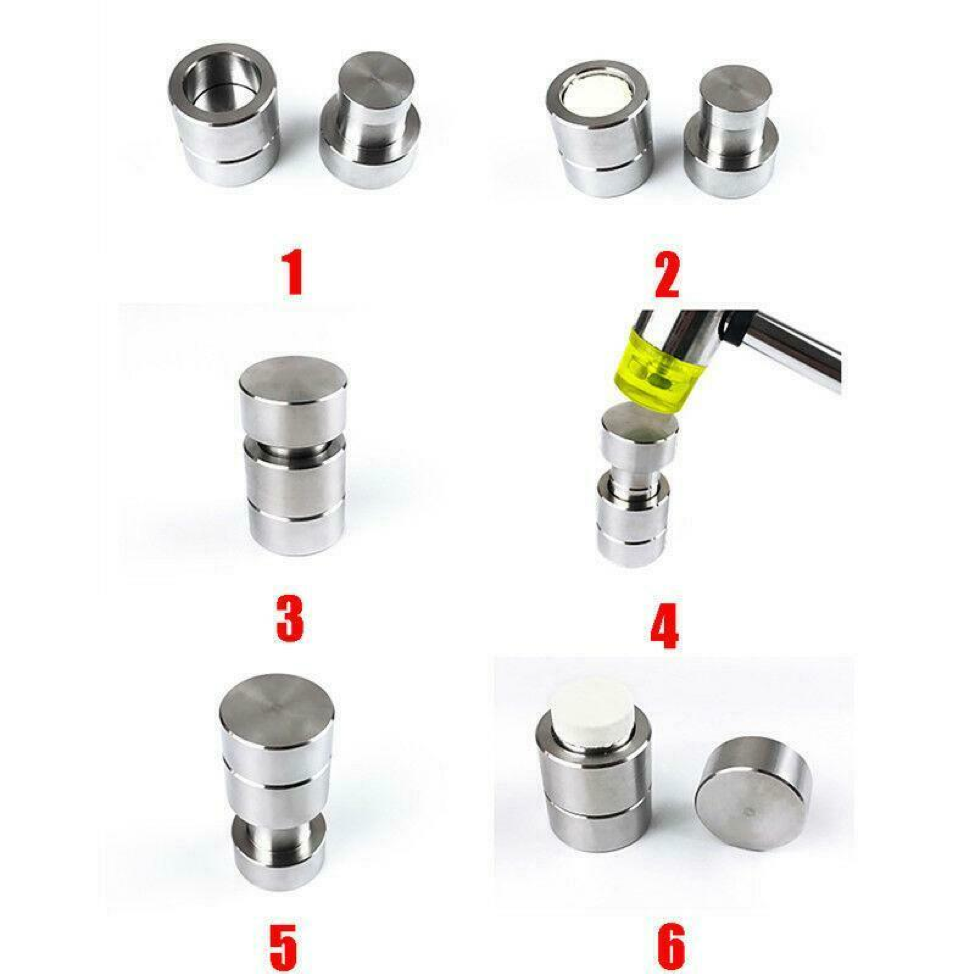

# BHV Workshop - DIY Medicine Workshop
 
_Biohacking Village DIY Workshops_
 
As part of our commitment to biohacking and open science, this 2019 DEF CON [Biohacking Village](https://www.villageb.io/)  workshop has been converted to a DIY/at home format. We hope you find this project instructive.
 
## About This Workshop
**Workshop leads:** Mixæl S. Laufer, Nick Titus
 
Have you ever wanted to make your own medicine? Well, just like anything else you can DIY it. Come hang out with the Four Thieves Vinegar Collective and learn how to press tablets, capsules, formulate transdermal patches, build autoinjectors, and hack vape pens into inhalers. We will also cover how to properly research and source the active pharmaceutical ingredients you need to compound these medicines. Why wait for infrastructure and legality to catch up with your needs, when you can just make what you need on the spot yourself? Let's take back the right to health.

 ## Personalized Medicine Research 

Do your research in advance. This workshop covers some basic methods to compound ingredients (make pills, capsules etc) but you will need to research the active ingredient(s) and the best method for taking them beforehand.  

When it comes to acting on your own behalf medically, you aren’t going to substitute medical knowledge and experience in a matter of weeks. You will be able to learn specific things that pertain to your health and treatment. Part of taking charge of your health is working with your medical practitioners when possible and always doing through research. More than read a couple webpages, you should download medical studies and pharmaceutical textbooks. You should look for bias and seek out contradicting information. 

A good starting point is to learn how to read and understand studies so you can spot their weaknesses and strengths. 
* https://www.eufic.org/en/understanding-science/article/understanding-scientific-studies
* https://chriskresser.com/how-to-read-and-understand-scientific-research/
* https://medlineplus.gov/understandingmedicalresearch.html

Research can come in many forms, it is important to critically review all material. 
* Scientific Studies and Papers
  * Read scientific papers and understand the flaws of the experiment and the uncertainty of the data. 
    * Seek out studies that disprove what you are researching
  * Resources: Use PubMed, SciHub, Google Scholar, and get a library card from a local university that grants access to scientific journals
* Textbooks
  * Read pharmaceutical textbooks to understand your active ingredients including how to calculate dose, forms that it can be taken in, and all the known effects and side-effects. 
  * Resources: Check your local library, booksellers and [B-OK](https://b-ok.org/) 
* Books - Specific Subject
  * Many “experts” write pop culture health books, generally to sell you something
    * Check their credentials and determine their bias. 
    * Research their claims and read all the studies they cite
    * Read critical reviews and analysis of their work
  * Resources: Check your local library, booksellers and [B-OK](https://b-ok.org/) 
* Consult medical experts and leading researchers to about data, findings, and questions you have
 
======

Disclaimer:
The information provided in this workshop is not intended as medical advice. The user accepts all risk associated with the guidance, claims, and references provided within this presentation. If you are able, please consult your physician and other medical professionals. 

### Active Ingredient 

Based your robust research you know the active ingredient(s) and best forms to take it, now you will need to source it. Most often you will purchase the active ingredient(s) online. Most chemical suppliers will need your business address and some will want a link to your lab’s website.  

Ingredients come in different grades and a chemical supplier will likely have many listings of the same substance. You will need to research the different grades and choose the one is best suited to your needs. Some grades are based on meeting the standards of certain organizations (e.g. American Chemical Society (ACS), United States Pharmacopeia (USP), European Pharmacopoeia (EP)). Each organization has different standards but usually their grades are pharmaceutical grade and have a higher price. Also some suppliers may have additional questions about your company's usage since they could be used to make drugs. Suppliers generally don’t have that concern with other grades, such as the reagent grade. Be sure to understand what the grade differences mean in terms of acceptable impurity levels and what types of impurities they test for. [General info on grades](https://www.labmanager.com/business-management/2017/11/the-seven-most-common-grades-for-chemicals-and-reagents)

Generally an ingredient and grade will have a CAS number that most suppliers use. You can research what you are looking for on a larger site like Sigma Aldrich, you can its CAS number and supplier information. Be sure to read all the information so you know what to look for on smaller sites and so you have a full understanding of the ingredient you are buying.

-----

### Quality Concerns

Buying from larger, reputable chemical suppliers gives you assurance of quality and that is reflected in the price. If you have concerns about quality from a supplier, you could have your ingredient(s) tested using Gas Chromatography-Mass Spectrometry (GC-MS). However the cost of testing would need to be factored in. It may be worth it for a large lot that only needs one test or a small lot that is cheap enough or critical enough to be worth the added cost.

In addition to a paid service, GC-MS testing might be able to be done by a friend working at a university laboratory or possibly by harm reduction groups (although their machines are unlikely to be programmed to look for your specific pharmaceutical ingredients).  

----

## Press tablets
This delivery method dissolves quickly and delivers a precise dose. Be sure to research this delivery method and risks.  

### Manual Press
The advantage of the manual press over the screw press is that the die is cheaper and with no moving parts it will last much longer without needing repair. 

**Materials:**
* [Tooling die - press (tap)](https://www.amazon.com/Milk-Make-Press-Hand-Made-Pressure/dp/B082TV2ZLW)
* [Digital scale-  milligram (50 X 0.001g](https://www.amazon.com/gp/product/B071WTJNYG/ref=ppx_yo_dt_b_asin_title_o03_s00?ie=UTF8&psc=1)
* Buffer - Powdered Milk
* Binder - Confectioner’s Sugar
* Active ingredients 
* Small mist sprayer bottle, filled with water 
* Hammer or mallet

**Practice Instructions:**

**Before using the (expensive) active ingredients, make a dozen pills with just the buffer and binder to get decent at the technique. The volume of buffer-binder mix and amount of water to spray on each layer requires some trial and error before you will consistently turn out the size tablet you want.**

* Mix equal parts powdered milk and confectioner’s sugar to make a buffer-binder mix.
* Assemble the bottom of the die (place the ring piece over the short piece) [Number 1 in the image]
* Spray water inside the die to dampen (more of an even mist)
* Add half the volume of buffer-binder mix you need to achieve the tablet size you want
* Spray with water to dampen 
* Adding  second half of  buffer-binder mix 
* Spray with water to dampen 
* Put long piece into the die [Number 3 in the image]
* Use a hammer to pound the die together to compress the ingredients into a tablet.[Number 4 in the image]
* Flip the die upside down [Number 5 in the image]
* Slide the ring down onto the long piece and then remove the short piece to reveal the tablet  [Number 6 in the image]
* Tilt the die over a paper towel and drop the tablet on to the paper towel
* Let the tablet air dry for a few minutes

Tip: Check this short [video clip of tablet making (business site)](https://homieholdshop.com/products/milk-set) in action.

Image Source: [eBay](https://www.ebay.com/itm/Small-Manual-Milk-Powder-Pressure-Milk-Machine-Milk-Tablet-Press-Machine-HS3-/193223823091)

##

**Tablet Making Instructions:**

Once you are consistently making pills, you can start making them with the active ingredient. 

* Mix equal parts powdered milk and confectioner’s sugar to make a buffer-binder mix.
* Assemble the bottom of the die (place the ring piece over the short base piece) [Number 1 in the image]
* **Measure the active ingredient (mg)**
* Spray water inside the die to dampen (more of an even mist)
* Add half the volume of buffer-binder mix you need to achieve the tablet size you want
* Spray with water to dampen 
* **Add the active ingredient**
* Spray with water to dampen 
* Add the second half of  buffer-binder mix 
* Spray with water to dampen 
* Put long tap-in long piece into the die [Number 3 in the image]
* Use a hammer to pound the die together to compress the ingredients into a tablet.[Number 4 in the image]
* Flip the die upside down [Number 5 in the image]
* Slide the ring down onto the tap-in piece and then remove the base piece to reveal the tablet  [Number 6 in the image]
* Tilt the die over a paper towel and drop the tablet on to the paper towel
* Let the tablet air dry for a few minutes

##

### Screw Press

The advantage of the screw press over the manual press is that the die is that the screw press makes it easier to apply force and it can be applied over a longer time.

Materials:
* [Tooling die - press (screw)](https://www.amazon.com/gp/product/B07HFZT9ZM/)
* [Digital scale-  milligram (50 X 0.001g)](https://www.amazon.com/gp/product/B071WTJNYG/ref=ppx_yo_dt_b_asin_title_o03_s00?ie=UTF8&psc=1)
* Buffer - Powdered Milk
* Binder - Confectioner’s Sugar
* Active ingredients 
* Small mist sprayer bottle, filled with water 

**Practice Instructions:**

**Before using the (expensive) active ingredients, make a dozen pills with just the buffer and binder to get decent at the technique.**
* Mix equal parts powdered milk and confectioner’s sugar to make a buffer-binder mix.
* Assemble the bottom of the die (screw the base piece into the tube piece) 
* Spray water inside the die to dampen (more of an even mist)
* Add half the volume of buffer-binder mix you need 
* Spray with water to dampen 
* Adding  second half of  buffer-binder mix 
* Spray with water to dampen 
* Add the second half of  buffer-binder mix 
* Spray with water to dampen 
* Slide the screw plunger into the die 
* Turn the screw plunger handle until the ingredients are compressed 
* When ready, remove the base of the die
* Turn the screw handle until the tablet is pushed out of the tube
* Let the tablet drop on to a paper towel and air dry briefly

 

**Tablet Making Instructions:**

Once you are consistently making pills, you can start making them with the active ingredient. 
* Mix equal parts powdered milk and confectioner’s sugar to make a buffer-binder mix.
* Assemble the bottom of the die (screw the base piece into the tube piece) 
* **Measure the active ingredient (mg)**
* Spray water inside the die to dampen (more of an even mist)
* Add half the volume of buffer-binder mix you need 
* Spray with water to dampen 
* **Add the active ingredient**
* Spray with water to dampen 
* Add the second half of  buffer-binder mix 
* Spray with water to dampen 
* Slide the screw plunger into the die 
* Turn the screw plunger handle until the ingredients are compressed 
* When ready, remove the base of the die
* Turn the screw handle until the tablet is pushed out of the tube
* Let the tablet drop on to a paper towel and air dry briefly

----

## Hand-fill Capsules  

This method won't dissolve quickly (like tablets). Be sure you active ingrediant allows for a capsule form. Be sure to research this delivery method and risks.

**Materials:**
* Size 00 joined capsules (gelatin or vegan)
* Digital scale-  milligram (50 X 0.001g)
* Active ingredients 
* Wax paper - 2 inches square (or larger depending on volume of ingredient)
* Small funnel (optional)
* Capsule holder (optional if you are making many capsules at a time) 
  * Make one with scrap wood [link](https://fillyourowncapsules.com/5-easy-ways-to-hand-fill-capsules/), buy one online or use a capsule machine as just a holder 

**Capsule Making Instructions:**
* Put wax paper on the scale and tare to 0
* Measure active ingredients on wax paper on the scale
* Pull apart capsule
* Put active active ingredients in one half of capsule, using either funnel or folding  wax paper in half to make a chute
* Put capsule back together

-----

## Transdermal patches 
There’s no easy way for you to know that exact amount that will absorbed or how quickly so this method is not for an emergency delivery and not for specific doses. Be sure to research this delivery method and risks. 

**Materials:**
* [DMSO - Dimethyl sulfoxide liquid](https://www.amazon.com/gp/product/B00ZNV5N8U/)
* [Gauze Sponges 4” x 4”](https://www.amazon.com/gp/product/B00LITWW0S/)
* [First Aid Tape, 1-Inch](https://www.amazon.com/Nexcare-Flexible-Clear-1-Inch-10-Yards/dp/B001G7R9YQ/)
* Plastic wrap
* Small container and stirring utensil, glass or stainless steel
* Do not use plastic and be cautious of other materials -- DMSO is a strong solvent and you don’t want to pick up contaminants 

**Instructions:**
* Put DMSO in the small container and add the active ingredient 
* There is no exact ratio, use plenty of DMSO 
* Stir until dissolved.
* Soak the DMSO mix into the gauze 
* Tape the gauze to yourself 
* Cover with plastic wrap - wrap around site or tape a piece over it

-----
## Autoinjectors

The Four Thieves Vinegar Collective has an instructions (text and video) for making an autoinjector for epinephrine, called the Epipencil, from off-the-shelf parts. Be sure to research this delivery method and risks.

Epipencil Instructions: https://fourthievesvinegar.org/blog/2016/09/introducing-the-epipencil

-----
## Vape pen cartridge

This method would be good to put a nonspecific dosage of an active ingredient in your system fast (e.g. possibly caffeine, B12 or for asthma). Currently being researched, the concept is that the active ingredient would be dissolved into the carrier fluid (propylene glycol and vegetable glycerin mix.

==
Yet Another Disclaimer:
The information provided in this workshop is not intended as medical advice. The user accepts all risk associated with the information, claims,and references provided within this presentation. If you are able, please consult your physician and other medical professionals. 

